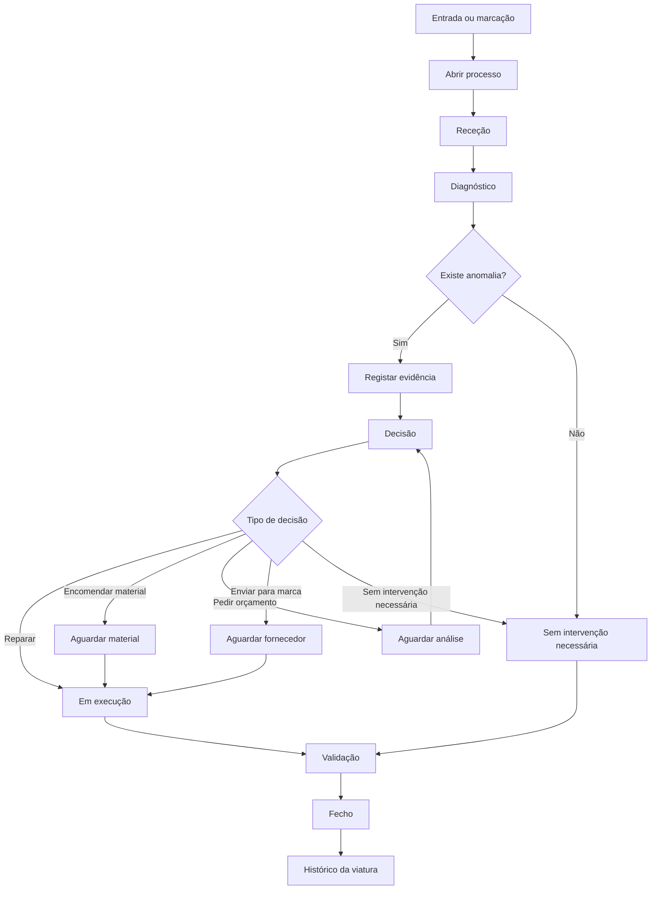
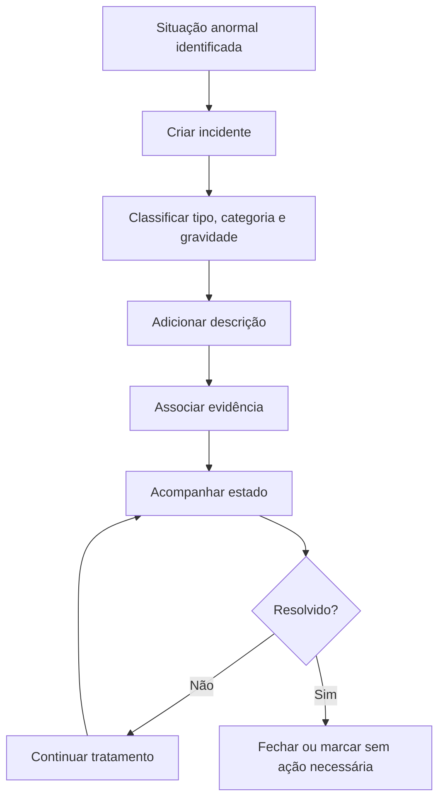

# Processo de Oficina CarFast v2

Documento de referência operacional e funcional

Data: 15/05/2026

## Estado fechado para implementação

Pontos fechados até esta revisão:

- O fluxo base é: abertura, receção, verificar histórico, revisão Stellantis / Service Box quando aplicável, registo de leitura técnica / BSI, registo de informação técnica, verificações sistemáticas, serviços a executar / orçamento, registar decisão, registo de leitura técnica / BSI final, fecho técnico, fecho administrativo e fecho sem intervenção.
- A receção deve recolher data de entrada, KM de entrada, serviço/motivo de entrada e observação inicial.
- Os serviços iniciais disponíveis são: revisão, pneus, calços, discos, luz/avaria no painel, ruído anormal, acidente/dano, bateria, verificação periódica e outro.
- Nos travões, quando aplicável, deve distinguir frente e trás.
- Em viaturas Stellantis, o passo Service Box entra após a verificação de histórico e deve suportar plano de manutenção, simulação por KM/idade e campanhas técnicas.
- O diagnóstico técnico fica flexível. Ainda não está fechada a checklist definitiva de todos os campos BSI.
- A app não faz OCR dos PDFs nesta fase. O utilizador regista metadados e links para documentos externos.
- O histórico técnico é sempre acrescentado à viatura. Não substitui leituras anteriores.
- Ficheiros PDF, fotos e vídeos ficam em OneDrive/SharePoint ou storage externo. A base de dados guarda metadados, links, decisões, notas e histórico.
- Para oficina, a estrutura documental inicial deve ser por matrícula e tipologia: `Oficina / Matrículas / {MATRÍCULA} / {TIPO_DOCUMENTO}`.

## 1. Objetivo

O módulo de Oficina da CarFast v2 serve para acompanhar processos técnicos temporários associados a uma viatura permanente.

O objetivo não é substituir o Rentway nem criar um ERP oficinal completo nesta fase. O objetivo é garantir controlo operacional sobre:

- entrada ou marcação de viaturas;
- diagnóstico e acompanhamento técnico;
- decisões internas;
- evidências de situações anormais;
- incidentes associados;
- documentos ligados ao processo;
- histórico consultável por viatura;
- tarefas de follow-up quando necessário;
- fecho claro do processo.

O processo de oficina deve ser simples para a operação, mas suficientemente estruturado para permitir auditoria, aprendizagem e evolução.

## 2. Princípios base

1. A viatura é a entidade permanente.
2. O processo de oficina é temporário.
3. Um processo deve nascer ligado a uma viatura.
4. O processo deve guardar histórico próprio sem contaminar os dados base da viatura.
5. Informação incompleta é aceitável no início.
6. Campos não devem ser obrigatórios quando a equipa ainda não tem informação.
7. Qualquer situação anormal deve ter evidência sempre que possível.
8. Fotos, vídeos, áudios e documentos não devem ser guardados como binário na base de dados.
9. A app deve guardar links, metadados, decisões, notas e histórico.
10. O Rentway continua a ser sistema operacional principal.
11. A CarFast v2 funciona como camada de controlo, follow-up, auditoria e decisão.
12. O fluxo deve poder evoluir sem partir o histórico já registado.

## 3. Conceito operacional

Um processo de oficina representa um caso técnico em aberto sobre uma viatura.

Exemplos:

- revisão;
- diagnóstico de ruído;
- avaria;
- dano identificado;
- preparação;
- reparação;
- validação pós-intervenção;
- situação reportada por cliente;
- situação reportada por estação;
- análise antes de colocar viatura em operação;
- intervenção sem necessidade de reparação final.

O processo deve responder a quatro perguntas:

1. O que aconteceu?
2. Em que ponto está?
3. Que decisão foi tomada?
4. Que evidências e documentos sustentam o processo?

## 4. Navegação prevista na aplicação

Menu lateral:

```text
Oficina
```

Ao abrir o menu `Oficina`, o utilizador vê uma página de entrada com duas opções:

```text
Novo processo
Gestão de processos
```

### 4.1 Novo processo

Página destinada a abrir um processo de oficina.

Campos principais:

- viatura;
- título;
- tipo de abertura;
- quilómetros de entrada;
- prioridade;
- saída prevista;
- nota inicial.

### 4.2 Gestão de processos

Página destinada a acompanhar processos abertos.

Mostra:

- processo;
- viatura;
- estado;
- decisão;
- ação de fecho;
- ligação para detalhe.

### 4.3 Detalhe do processo

Página central do processo.

Deve mostrar:

- dados principais;
- estado atual;
- decisão atual;
- nota inicial;
- histórico de notas;
- evidências;
- incidentes;
- documentos;
- ações de atualização.

## 5. Entidades principais

### 5.1 Viatura

Entidade permanente.

Campos relevantes para oficina:

- id;
- matrícula;
- Unit Nr Rentway;
- marca;
- modelo;
- VIN;
- estado operacional;
- estado de ciclo de vida;
- histórico de eventos;
- documentos associados;
- tarefas associadas;
- processos de oficina associados.

Regra:

> A oficina nunca deve criar uma viatura temporária se a viatura já existir na frota. Deve ligar sempre ao registo permanente.

### 5.2 Processo de oficina

Entidade temporária.

Campos atuais:

- id;
- vehicle_id;
- título;
- tipo de abertura;
- estado;
- prioridade;
- origem;
- utilizador que abriu;
- data de abertura;
- saída prevista;
- quilómetros de entrada;
- decisão;
- nota da decisão;
- utilizador que decidiu;
- data da decisão;
- data de fecho;
- nota inicial.

### 5.3 Nota do processo

Regista acompanhamento manual ou automático.

Exemplos:

- confirmação de receção;
- diagnóstico;
- decisão explicada;
- contacto com fornecedor;
- material encomendado;
- validação final;
- alteração automática de estado.

Campos atuais:

- id;
- process_id;
- user_id;
- nota;
- data/hora.

### 5.4 Evidência do processo

Regista prova ou suporte técnico associado ao processo.

Tipos:

- foto;
- vídeo;
- documento;
- nota técnica.

Categorias:

- ruído anormal;
- dano visível;
- luz de avaria;
- desgaste irregular;
- fuga;
- peça partida;
- falha intermitente;
- quilómetros incoerentes;
- segurança;
- outra anomalia.

Estados:

- registada;
- analisada;
- resolvida;
- sem intervenção necessária.

Regra:

> A evidência deve guardar descrição, tipo, categoria, fase, estado e link externo quando existir. O ficheiro em si fica no SharePoint, OneDrive ou storage externo.

### 5.5 Incidente

Registo estruturado de uma situação anormal ou relevante, podendo nascer dentro do processo de oficina.

Tipos:

- técnico;
- dano;
- segurança;
- cliente;
- fornecedor;
- operacional;
- outro.

Categorias:

- ruído anormal;
- dano visível;
- luz de avaria;
- desgaste irregular;
- fuga;
- peça partida;
- segurança;
- documentação;
- reporte de cliente;
- outra situação.

Gravidade:

- baixa;
- média;
- alta;
- crítica.

Estados:

- novo;
- em análise;
- em tratamento;
- a aguardar decisão;
- a aguardar fornecedor;
- resolvido;
- fechado;
- sem ação necessária.

Evidências de incidente:

- foto;
- vídeo;
- áudio/nota de voz;
- documento;
- link externo.

### 5.6 Documento

Registo documental associado ao processo.

Exemplos:

- orçamento;
- fatura;
- folha de obra;
- relatório técnico;
- comprovativo;
- fotografia arquivada;
- vídeo arquivado;
- documento Rentway;
- comunicação relevante.

Regra:

> A app guarda o link e a classificação. O ficheiro fica fora da base de dados.

## 6. Fluxo operacional recomendado



## 7. Estados do processo de oficina

### 7.1 Abertura

Estado inicial.

Usar quando:

- o processo acabou de ser criado;
- ainda não existe receção física ou validação;
- a informação é mínima.

Exemplo:

```text
Cliente reporta ruído anormal na travagem.
```

### 7.2 Receção

Usar quando:

- a viatura entrou fisicamente;
- a equipa confirmou que a situação vai ser analisada;
- há contacto inicial com a oficina.

Exemplo de nota:

```text
Viatura recebida. Situação reportada confirmada em teste curto.
```

### 7.3 Diagnóstico

Usar quando:

- a viatura está a ser analisada;
- há validação técnica em curso;
- ainda não existe decisão final.

Exemplo de nota:

```text
Diagnóstico inicial indica desgaste irregular nas pastilhas dianteiras.
```

### 7.4 Decisão

Usar quando:

- há uma decisão operacional ou técnica a tomar;
- a equipa precisa de escolher próximo passo;
- a situação já foi analisada.

Decisões possíveis:

- reparar;
- aguardar análise;
- encomendar material;
- enviar para marca;
- pedir orçamento;
- sem intervenção necessária.

### 7.5 Aguardar análise

Usar quando:

- falta avaliação técnica;
- falta resposta interna;
- falta confirmação sobre o problema;
- falta decisão operacional.

Não usar quando:

- a peça já foi encomendada. Nesse caso usar `Aguardar material`.

### 7.6 Aguardar material

Usar quando:

- a intervenção depende de peças;
- a encomenda já foi ou vai ser feita;
- a viatura não pode avançar até receção do material.

Exemplo:

```text
Encomendar discos e pastilhas dianteiras.
```

### 7.7 Em execução

Usar quando:

- a reparação está a decorrer;
- a intervenção foi iniciada;
- a oficina está a atuar.

### 7.8 Validação

Usar quando:

- a intervenção terminou;
- falta confirmar resultado;
- falta teste de estrada;
- falta validação final antes de libertar a viatura.

### 7.9 Fechado

Usar quando:

- a conclusão é clara;
- a decisão final está registada;
- as evidências necessárias foram associadas;
- os documentos relevantes estão ligados ou pendentes de follow-up;
- a viatura pode seguir para o estado operacional adequado.

## 8. Decisões

As decisões representam a orientação operacional do processo.

### 8.1 Reparar

Quando existe intervenção a executar.

### 8.2 Aguardar análise

Quando ainda não existe informação suficiente.

### 8.3 Encomendar material

Quando a intervenção depende de peças.

### 8.4 Enviar para marca

Quando deve ser tratado por marca ou entidade técnica externa.

### 8.5 Pedir orçamento

Quando ainda é necessário obter proposta de custo ou autorização interna.

### 8.6 Sem intervenção necessária

Quando a situação foi analisada e não justifica intervenção.

Exemplos:

- ruído não confirmado;
- dano superficial sem impacto;
- reporte incorreto;
- situação já resolvida;
- anomalia sem ação técnica necessária.

## 9. Regras para abertura de processo

### 9.1 Quando abrir

Abrir processo quando existir:

- entrada física em oficina;
- marcação futura;
- avaria reportada;
- dano reportado;
- alerta técnico;
- necessidade de diagnóstico;
- preparação técnica;
- intervenção em fornecedor;
- necessidade de controlar decisão ou follow-up.

### 9.2 Quando não abrir

Não abrir processo quando:

- for apenas uma nota informativa sem seguimento;
- já existir processo aberto para a mesma situação;
- for uma tarefa administrativa sem impacto técnico;
- for apenas arquivo documental;
- for um pedido externo ainda não triado.

Nesses casos pode ser melhor:

- criar tarefa;
- associar documento;
- adicionar nota à viatura;
- aguardar triagem.

## 10. Regras para duplicados

Antes de abrir novo processo, verificar:

- matrícula;
- processos abertos da mesma viatura;
- tarefas abertas associadas;
- incidentes recentes;
- documentos recebidos;
- origem Rentway, quando aplicável.

Se já existir processo aberto:

- adicionar nota;
- adicionar evidência;
- atualizar estado;
- criar incidente dentro do processo, se for uma situação nova mas relacionada.

## 11. Evidências

### 11.1 Quando registar evidência

Registar evidência sempre que existir:

- dano visível;
- ruído anormal;
- luz de avaria;
- desgaste invulgar;
- fuga;
- peça partida;
- quilómetros incoerentes;
- situação de segurança;
- divergência com informação anterior;
- reclamação ou reporte sensível;
- qualquer situação que possa exigir decisão futura.

### 11.2 Tipos de evidência

Foto:

- danos visíveis;
- peças;
- tablier;
- quilómetros;
- luzes de avaria;
- pneus;
- exterior/interior.

Vídeo:

- ruídos;
- falhas intermitentes;
- vibrações;
- comportamento em teste;
- evidência dinâmica.

Áudio/nota de voz:

- explicação rápida do operador;
- relato técnico;
- contexto de decisão;
- informação verbal difícil de escrever no momento.

Documento:

- orçamento;
- folha de obra;
- fatura;
- relatório técnico;
- comunicação de fornecedor.

Nota técnica:

- observação escrita sem ficheiro;
- diagnóstico curto;
- explicação de decisão.

### 11.3 Onde guardar ficheiros

Ficheiros devem ficar em SharePoint/OneDrive ou storage externo.

Estrutura recomendada inicial para oficina:

```text
Oficina/
  Matrículas/
    AA-00-AA/
      Diagnóstico/
      BSI - Dados técnicos/
      Orçamentos/
      Faturas - Documentos fornecedor/
      Evidências foto-vídeo/
      Relatórios/
      Outros documentos de oficina/
```

Quando não existir matrícula:

```text
Oficina/
  Sem matrícula/
    2026/
      05/
        Tipo documento/
```

Recomendação:

> Para oficina, a estrutura por matrícula é a regra base, porque a viatura é a entidade permanente. A data/mês deve ser usada apenas quando não há matrícula ou quando a tipologia futura o justificar.

## 12. Incidentes dentro da oficina

Um incidente deve ser criado quando a situação merece tratamento próprio dentro ou fora da oficina.

Exemplos:

- dano relevante;
- risco de segurança;
- reclamação de cliente;
- falha que pode repetir;
- divergência operacional;
- situação com fornecedor;
- documentação em falta;
- necessidade de decisão da direção.

### 12.1 Diferença entre evidência e incidente

Evidência:

- prova ou suporte de algo observado.

Incidente:

- caso anormal que pode exigir análise, decisão, ação ou comunicação.

Um incidente pode ter várias evidências.

### 12.2 Fluxo do incidente



## 13. Documentos associados

Documentos devem ser ligados ao processo quando suportam a decisão ou o histórico.

Exemplos:

- orçamento;
- fatura;
- relatório;
- folha de obra;
- comprovativo de encomenda;
- email relevante;
- foto ou vídeo arquivado como documento;
- documento Rentway.

Campos úteis:

- título;
- estado;
- data;
- origem;
- canal de entrada;
- link original;
- link arquivado;
- notas.

Estados documentais:

- por classificar;
- classificado;
- arquivado;
- rejeitado/sem interesse.

## 14. Tarefas associadas à oficina

Nem todos os estados devem criar tarefa automaticamente nesta fase.

Na fase piloto, recomenda-se criação manual quando necessário.

Exemplos de tarefas:

- confirmar orçamento;
- pedir autorização;
- validar receção de material;
- confirmar arquivo de documentos;
- contactar fornecedor;
- validar viatura antes de voltar à operação;
- pedir decisão de direção.

Futuramente podem ser criadas regras automáticas.

Exemplos:

- estado `Aguardar material` cria tarefa para responsável de compras;
- decisão `Pedir orçamento` cria tarefa para equipa financeira/oficina;
- processo em `Validação` há mais de X horas cria alerta;
- processo aberto sem atualização há X dias cria follow-up.

## 15. Regras de fecho

Um processo só deve ser fechado quando:

- há conclusão clara;
- o estado final foi atualizado;
- a decisão está registada quando aplicável;
- notas essenciais foram adicionadas;
- evidências anormais foram registadas;
- documentos relevantes foram associados ou foi criada tarefa para os arquivar;
- a viatura ficou com situação operacional clara.

### 15.1 Fecho com reparação

Exemplo de nota:

```text
Intervenção concluída. Teste de estrada OK. Viatura apta para operação.
```

### 15.2 Fecho sem intervenção necessária

Exemplo de nota:

```text
Situação analisada. Não foi identificada necessidade de intervenção. Viatura validada.
```

### 15.3 Fecho com pendência documental

Se faltar documento:

- fechar o processo apenas se a intervenção estiver resolvida;
- criar tarefa de follow-up para arquivo documental;
- associar documento quando chegar.

## 16. Folha de fecho do processo

A folha de fecho deve permitir consultar o processo completo.

Conteúdo recomendado:

- número do processo;
- matrícula;
- Unit Nr;
- marca/modelo;
- data de abertura;
- data de fecho;
- tipo de abertura;
- prioridade;
- quilómetros de entrada;
- estado final;
- decisão final;
- nota inicial;
- notas cronológicas;
- evidências;
- incidentes;
- documentos;
- tarefas relacionadas;
- utilizadores envolvidos;
- auditoria resumida.

Exemplo de estrutura:

```text
PROCESSO DE OFICINA

Processo: #123
Viatura: AA-00-AA | Unit 200 | Fiat 500
Abertura: Marcação
Prioridade: Alta
KM entrada: 36 730
Data abertura: 15/05/2026
Data fecho: 16/05/2026

Estado final:
Fechado

Decisão:
Encomendar material

Resumo:
Cliente reportou ruído anormal na travagem.
Diagnóstico confirmou desgaste irregular.
Material substituído e teste final validado.

Evidências:
1. Foto - Desgaste irregular - link
2. Vídeo - Ruído anormal - link

Incidentes:
1. Incidente técnico - Gravidade média - Resolvido

Documentos:
1. Orçamento fornecedor - link
2. Fatura oficina - link

Resultado:
Viatura apta para operação.
```

## 17. Responsabilidades

### 17.1 Operador

- abrir processo;
- registar informação disponível;
- adicionar notas;
- anexar evidências por link;
- relatar dificuldades no piloto;
- atualizar estado quando executa ação.

### 17.2 Responsável de oficina

- validar diagnóstico;
- tomar ou propor decisão;
- controlar processos abertos;
- garantir fecho correto;
- acompanhar pendências.

### 17.3 Gestão operacional

- acompanhar atrasos;
- decidir em casos sensíveis;
- validar prioridades;
- analisar indicadores;
- definir regras futuras.

### 17.4 Administração/sistema

- manter utilizadores;
- ajustar permissões;
- configurar futuros workflows;
- garantir arquivo e auditoria.

## 18. Indicadores recomendados

Para uma fase seguinte, o dashboard de oficina deve mostrar:

- processos abertos;
- processos por estado;
- processos por prioridade;
- processos sem atualização recente;
- processos a aguardar material;
- processos a aguardar análise;
- tempo médio até diagnóstico;
- tempo médio até fecho;
- viaturas paradas por oficina;
- incidentes por gravidade;
- evidências registadas;
- documentos por arquivar.

## 19. Alertas recomendados

Fase futura:

- processo aberto há mais de X dias;
- processo em `Aguardar material` sem atualização;
- processo em `Diagnóstico` há mais de X horas;
- processo sem responsável;
- viatura com incidente crítico;
- processo fechado sem evidência quando existia incidente;
- processo fechado sem nota final;
- documento de oficina por classificar.

## 20. Permissões recomendadas

### Consulta

Pode ver processos e histórico.

### Operador

Pode criar processos, notas, evidências e incidentes.

### Responsável

Pode alterar estados, decisões e fechar processos.

### Administração

Pode configurar regras, utilizadores e permissões.

Na fase atual, as permissões ainda devem manter-se simples para não bloquear o piloto.

## 21. Integração com Rentway

O Rentway deve continuar a ser a fonte operacional principal para dados externos.

Dados que podem influenciar oficina:

- frota;
- contratos;
- impros;
- folhas de obra;
- faturas fornecedores;
- sinistros;
- accident reports;
- histórico de utilização;
- quilometragem;
- estados de viatura.

Regras:

- importações Rentway não apagam comentários internos;
- importações Rentway não apagam decisões internas;
- importações Rentway não apagam tarefas;
- importações Rentway não apagam anexos;
- importações Rentway não apagam histórico;
- campos manuais devem sobreviver a importações.

## 22. Integração com documentos 365

O módulo deve estar preparado para SharePoint/OneDrive.

Objetivo:

- documento chega;
- operador decide tipologia;
- documento é arquivado em pasta correta;
- app guarda link e classificação;
- processo fica com documento associado.

Exemplo:

```text
Viatura AA-00-AA
Processo oficina #123
Documento: Fatura oficina
Pasta: Oficina/Matrículas/AA-00-AA/Faturas - Documentos fornecedor/
```

## 22.1 Importação de histórico técnico

A importação de histórico técnico aceita um ficheiro de preparação com metadados dos PDFs já organizados.

Campos aceites nesta fase:

- matrícula;
- VIN/chassi;
- data do documento;
- tipo de registo;
- origem/máquina;
- ficheiro de origem;
- ficheiro de arquivo;
- estado da preparação;
- indicação se o ficheiro foi copiado para o arquivo;
- hash SHA1;
- chave de importação.

Regras:

- só devem entrar as linhas finais copiadas para o arquivo;
- linhas duplicadas por `sha1` ou `chave_importacao` não devem criar leituras repetidas;
- quando não existe matrícula, o VIN/chassi deve permitir associar a leitura à viatura;
- o caminho do PDF fica como referência/link externo;
- a importação cria histórico técnico na ficha da viatura, sem fechar os campos técnicos detalhados do BSI.

## 23. Botões de apoio no piloto

Todos os menus devem ter:

- `Pedir ajuda`;
- `Relatar experiência`.

No contexto de oficina:

- se usado dentro do processo, o registo deve ficar associado ao processo;
- se usado no menu oficina, fica associado ao módulo;
- os relatos ficam centralizados em Administração.

Objetivo:

- perceber dúvidas reais;
- corrigir UI;
- detetar campos a mais;
- detetar campos em falta;
- melhorar formação;
- ajustar fluxo antes de automatizar.

## 24. Processo de teste piloto

### Teste 1 - Abrir processo

Objetivo:

- validar se o utilizador consegue criar processo sem ajuda.

Passos:

1. Abrir `Oficina`.
2. Escolher `Novo processo`.
3. Selecionar viatura.
4. Preencher informação disponível.
5. Criar processo.

Resultado esperado:

- processo criado;
- aparece na gestão;
- detalhe abre corretamente.

### Teste 2 - Acompanhar processo

Objetivo:

- validar atualização de estados, notas e evidências.

Passos:

1. Abrir `Gestão de processos`.
2. Entrar num processo.
3. Atualizar estado.
4. Adicionar nota.
5. Registar evidência.

Resultado esperado:

- histórico fica visível;
- evidência fica ligada;
- utilizador entende o fluxo.

### Teste 3 - Registar incidente

Objetivo:

- validar situações anormais.

Passos:

1. Entrar no processo.
2. Criar incidente.
3. Classificar tipo, categoria e gravidade.
4. Adicionar evidência foto, vídeo, áudio ou link.

Resultado esperado:

- incidente fica ligado ao processo e à viatura;
- evidência fica consultável.

### Teste 4 - Fechar processo

Objetivo:

- validar conclusão.

Passos:

1. Confirmar notas e decisão.
2. Adicionar nota final.
3. Atualizar estado para fechado.

Resultado esperado:

- processo deixa de aparecer em abertos;
- histórico mantém-se acessível pelo detalhe e pela viatura quando existirem vistas de arquivo completas.

## 25. Critérios de sucesso do piloto

O piloto é positivo se:

- utilizadores conseguem abrir processo sem formação longa;
- estados são compreendidos;
- evidências são registadas quando há anomalias;
- dúvidas ficam registadas pelo botão de ajuda;
- relatos de experiência indicam melhorias concretas;
- o fluxo não obriga a preencher informação indisponível;
- a equipa percebe onde está cada processo;
- gestão consegue ver processos abertos;
- fecho é claro.

## 26. Pontos em aberto para decisão

### 26.1 Responsável obrigatório

Decidir se processo de oficina deve ter sempre:

- responsável pessoa;
- equipa;
- ambos opcionais.

Recomendação:

> A médio prazo deve existir sempre responsável pessoa ou equipa. No piloto pode ser flexível.

### 26.2 Estados que geram tarefas

Ainda por decidir.

Candidatos:

- aguardar material;
- pedir orçamento;
- enviar para marca;
- validação;
- processo sem atualização;
- documento por arquivar.

### 26.3 Arquivo de processos fechados

Necessário criar vista:

- processos abertos;
- processos fechados;
- todos;
- por matrícula;
- por período;
- por decisão.

### 26.4 Fecho com checklist

Futuro:

- decisão final preenchida;
- nota final;
- evidência quando existe incidente;
- documento final ou tarefa de arquivo;
- estado operacional da viatura.

### 26.5 Upload direto de ficheiros

Futuro:

- upload isolado;
- antivírus;
- validação;
- limite de tamanho;
- armazenamento externo;
- ligação automática ao processo.

## 27. Melhorias técnicas recomendadas

### Fase curta

- vista de arquivo de processos fechados;
- filtros por estado, matrícula e prioridade;
- responsável pessoa/equipa;
- data de última atualização do processo;
- botão claro para criar tarefa a partir do processo;
- folha de fecho em HTML/impressão/PDF;
- ligação mais visível à ficha da viatura.

### Fase média

- SLAs por tipo de processo;
- alertas de atraso;
- tarefas automáticas por estado;
- integração com SharePoint/Power Automate;
- templates de comunicação;
- painel de oficina no dashboard;
- permissões por equipa.

### Fase avançada

- integração Rentway mais profunda;
- importação de folhas de obra;
- leitura automática de documentos;
- IA para resumo do processo;
- IA para sugerir classificação de incidentes;
- análise de reincidências por viatura/modelo/fornecedor;
- aplicação mobile/PWA para registo rápido de evidências.

## 28. Checklist operacional

Antes de abrir:

- confirmar matrícula;
- verificar se já existe processo aberto;
- recolher informação disponível;
- escolher tipo de abertura.

Durante:

- atualizar estado;
- registar notas relevantes;
- registar evidências anormais;
- criar incidente quando necessário;
- associar documentos;
- criar tarefa se existir follow-up.

Antes de fechar:

- confirmar decisão;
- escrever nota final;
- validar se há evidências suficientes;
- validar documentos;
- indicar resultado operacional;
- fechar processo.

## 29. Resumo executivo

O processo de oficina da CarFast v2 deve funcionar como um caso operacional temporário ligado à viatura.

Na fase atual, o foco deve ser:

- abrir processos com poucos campos;
- acompanhar estados;
- registar decisões;
- guardar notas e evidências;
- criar incidentes quando necessário;
- associar documentos por link;
- fechar com clareza;
- recolher feedback real dos utilizadores.

A evolução deve ser feita depois de observar utilização real, evitando automatizar cedo demais.

O objetivo final é transformar a oficina num fluxo auditável, simples e escalável, sem tornar a operação pesada.
