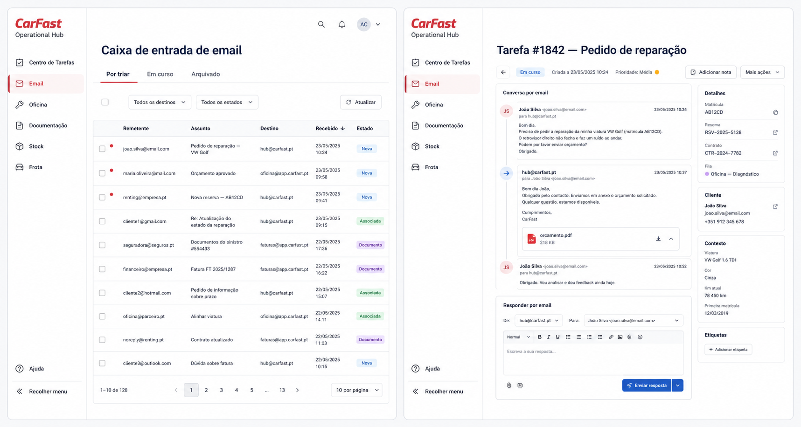

# Proposta de implementação — teste interno de email

## Decisão proposta

Implementar primeiro um piloto controlado com `hub@carfast.pt` como remetente. O piloto fica limitado a utilizadores internos e a destinatários de `carfast.pt` e `daccordinvest.pt` enquanto a conta Postmark estiver em modo de teste.

O plano gratuito serve para validar o envio e a experiência de resposta na aplicação. A receção automática por webhook, o encaminhamento das respostas para a tarefa certa e as caixas técnicas por módulo entram quando for ativado o plano Postmark Pro.

## Fase 1 — piloto gratuito: envio

1. Adicionar à aplicação uma ação **Responder por email** dentro da tarefa.
2. Enviar através do stream Transactional do Postmark, com `From: hub@carfast.pt`.
3. Guardar na tarefa o destinatário, assunto, corpo sanitizado, anexos, utilizador, data, estado e identificador devolvido pelo Postmark.
4. Mostrar o email enviado na cronologia da tarefa.
5. Receber eventos de entrega e bounce, quando disponíveis, para mostrar `Enviado`, `Entregue` ou `Falhou`.
6. Nesta fase, respostas recebidas continuam na caixa Microsoft 365 de `hub@carfast.pt`; não entram automaticamente na aplicação.

## Fase 2 — Postmark Pro: receção e respostas

1. Criar o subdomínio técnico `inbound.app.carfast.pt`, sem alterar o MX principal de `carfast.pt`.
2. Encaminhar no Microsoft 365 as mensagens destinadas à aplicação para o endereço inbound indicado pelo Postmark, mantendo uma cópia na caixa empresarial.
3. Criar o webhook inbound autenticado da aplicação.
4. Colocar mensagens novas em **Centro de Tarefas → Email → Por triar**.
5. Usar um endereço de resposta com token opaco, por exemplo `reply+<token>@inbound.app.carfast.pt`, para anexar respostas à conversa correta.
6. Encaminhar emails conhecidos para Oficina, Documentação, Stock, Frota ou a fila adequada; mensagens ambíguas ficam por triar.
7. Guardar anexos em armazenamento persistente e apenas metadados na base de dados.

## Fase 3 — endereços por operação

Ativar gradualmente os endereços públicos `tarefas@`, `oficina@`, `faturas@`, `stock@` e `auditoria@`, todos em Microsoft 365, com encaminhamento técnico para o Postmark. Cada destino define fila, permissões, comportamento por defeito e remetente autorizado.

## Modelos de email

A solução deve incluir modelos administráveis, reutilizáveis e versionados. Um modelo define assunto, corpo, remetente autorizado, anexos opcionais, botões para páginas externas e variáveis de contexto, sem guardar segredos.

Exemplos iniciais:

- Confirmação de receção de pedido;
- Pedido e envio de orçamento de oficina;
- Aprovação ou rejeição de orçamento;
- Marcação e confirmação de intervenção;
- Pedido de documentos ou fotografias;
- Documento em falta ou inválido;
- Pedido de preço e disponibilidade de peça;
- Confirmação de encomenda e receção de stock;
- Aviso de inspeção, manutenção, seguro ou contrato da frota;
- Pedido de validação de fatura;
- Notificação de conclusão de tarefa ou processo.

Os modelos devem suportar variáveis validadas, como nome, matrícula, reserva, contrato, número do processo, datas e responsável. Antes do envio, o utilizador vê sempre uma pré-visualização e pode editar apenas os campos autorizados. Alterações de modelos ficam em auditoria.

## Integração nos processos existentes

O Email funciona como canal transversal, não como fonte paralela de processos:

- **Oficina:** pedir orçamento, enviar aprovação, marcar intervenção, solicitar evidências e anexar respostas ao processo da viatura;
- **Stock:** pedir cotação/disponibilidade, acompanhar encomendas e associar confirmações a artigos ou movimentos;
- **Frota:** enviar alertas, pedir marcações, acompanhar seguros, inspeções, contratos e ocorrências por matrícula;
- **Documentação:** solicitar documentos através de página externa, receber anexos, validar, rejeitar ou classificar e associar ao registo correto;
- **Centro de Tarefas:** criar tarefas com conteúdo selecionado, associar conversas, acompanhar prazos e concluir sem expor o email a utilizadores não autorizados.

Cada processo poderá ter ações como **Enviar email**, **Usar modelo**, **Ver conversa**, **Pedir documentos** e **Abrir tarefa associada**. As permissões do processo e da caixa de email são avaliadas separadamente; ter acesso à tarefa não implica acesso à correspondência original.

## Páginas externas de resposta

Os botões dos modelos abrem páginas externas isoladas, por token temporário e com âmbito limitado. Estas páginas permitem responder, anexar documentos, confirmar datas ou tomar decisões simples sem conceder acesso ao Operational Hub. As respostas e anexos regressam ao processo e à conversa correspondentes.

## Aprovação antes do envio

O sistema deve permitir exigir aprovação antes de uma resposta sair para o exterior. A regra pode ser definida:

- na categoria ou caixa de email, como comportamento por defeito;
- no modelo de email utilizado;
- no tipo de processo;
- no momento de criar a tarefa destinada a resolver o email;
- manualmente numa resposta específica.

Fluxo previsto:

1. O responsável executa a tarefa e prepara uma proposta de resposta;
2. Submete o rascunho para aprovação, indicando o aprovador ou grupo;
3. A conversa fica em `A aguardar aprovação` e não é enviada;
4. O aprovador pode aprovar e enviar, aprovar para envio pelo responsável, ou devolver com comentários;
5. Após o envio, a conversa passa para `A aguardar resposta`, mantendo a versão aprovada e o comprovativo de envio.

Devem existir permissões separadas para `Preparar resposta`, `Submeter para aprovação`, `Aprovar`, `Editar após submissão` e `Enviar`. Qualquer alteração ao destinatário, assunto, corpo, anexos ou valores depois da aprovação invalida a aprovação e exige nova validação.

A auditoria regista autor, versões, comentários, aprovador, data, decisão, remetente utilizado e resultado do envio. O utilizador que apenas trata a tarefa pode preparar a resposta sem obter acesso ao restante conteúdo protegido da conversa; recebe apenas o contexto expressamente partilhado pelo responsável da caixa.

## Experiência proposta

- **Caixa de entrada:** lista única com filtros por destino, estado e módulo; novas mensagens ficam por triar.
- **Conversa da tarefa:** emails recebidos e enviados aparecem numa cronologia única.
- **Associação:** matrícula, reserva, contrato, fatura ou documento podem ser associados manualmente ou por regras confiáveis.
- **Resposta:** o operador responde dentro da tarefa usando `hub@carfast.pt`; a resposta futura regressa à mesma conversa.
- **Segurança:** HTML sanitizado, limites de tamanho, validação de anexos, controlo de acesso por fila e auditoria integral.

## Critérios de aceitação do piloto

- Um utilizador autorizado consegue enviar um email de uma tarefa para um endereço de teste permitido.
- O email aparece na cronologia sem expor a chave Postmark.
- Falhas são visíveis e permitem nova tentativa segura, sem duplicar mensagens.
- Um anexo permitido é enviado e fica associado à tarefa.
- Nenhuma alteração é feita no MX principal de `carfast.pt`.
- A funcionalidade pode ser desligada por variável de ambiente sem remover dados.

## Ordem de execução

1. Concluir a aprovação da conta Postmark e verificar DKIM/Return-Path de `carfast.pt`.
2. Implementar e testar a Fase 1 em staging.
3. Fazer um smoke test com utilizadores e domínios internos autorizados.
4. Só depois decidir a passagem para Pro e ativar a Fase 2.

## Mockup

O mockup é conceptual: serve para validar o fluxo e a disposição antes da implementação, não representa ainda código existente.
